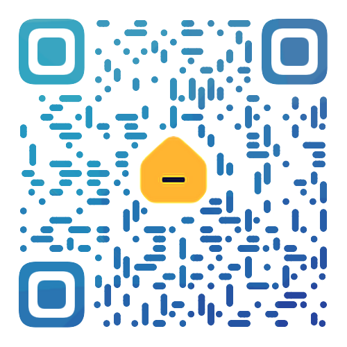

# Blog
A personal blog created by VuePress 1.x.



## Access URLs

- [https://jasonbai008.github.io](https://jasonbai008.github.io)
- [https://blog.jasonbai.dpdns.org](https://blog.jasonbai.dpdns.org)
- [https://jasonbaiblog.netlify.app](https://jasonbaiblog.netlify.app)
- [https://bai-blog.pages.dev](https://bai-blog.pages.dev)

## Features
- 支持热更新 
- 支持自动打开浏览器
- 支持返回顶部
- 支持外链资源
- 支持一键部署
- 支持图片放映
- 支持自定义样式
- 支持自定义主题色
- 支持自定义组件
- 支持代码一键复制
- 支持留言板

## Directory Structure
```
├── docs (打包后目录)
├── src  (博客文档源文件)
│   ├── .vuepress 
│   │   ├── components
│   │   ├── theme
│   │   │   └── Layout.vue
│   │   ├── public (图片资源)
│   │   ├── styles
│   │   │   ├── index.styl  (自定义样式)
│   │   │   └── palette.styl  (全局主题样式变量)
│   │   └── config.js  (路由导航)
│   │ 
│   ├── README.md
│   ├── guide
│       └── README.md
│ 
└── package.json
```

## 看板娘本地化
1. 看板娘插件默认使用的是黑猫
2. 加载线上的资源太慢，所以做了本地化
3. node_modules\@vuepress-reco\vuepress-plugin-kan-ban-niang\bin\KanBanNiang.vue
4. 改成：blackCat:'/blog/mode/hijiki.model.json'
5. 看板娘需要加载的资源放在了：src\.vuepress\public\mode
